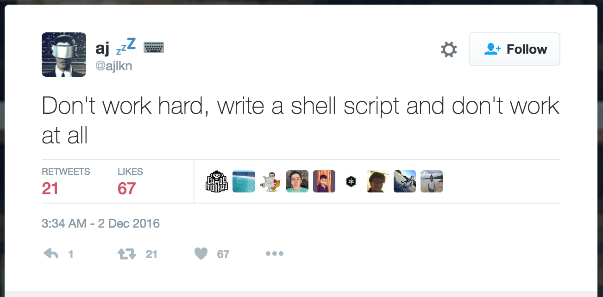

# Command line & git productivity tips 🎉

I'm going to talk about:

## CLI:
- aliases
- functions
- history & history search
- how to combine them to improve your workflow
- some nice CLI tools that help
- might touch on `$PATH`

## git
- some git config tips
- aliases
- extending git with your own custom commands
- hub & diff-so-fancy
- browser extensions for GitHub

---

## Who is familiar with this xkcd chart?


---

## CLI

Common commands:

- `ls`
- `cd` so old school 😝  use `zsh` or enable auto cd in bash `shopt -s autocd` (requires bash >= 4)
    or even better don't use `cd` at all, more on this later.
- `echo`
- `cat`

**tip** you can do `cd -` to go to last folder you were at.

---

## How aliases work

```
alias [your alias name]="your command(s) here"
```

Very simple. Use them.

---

## Functions

Are more powerful than aliases, you can pass parameters & do more complex stuff

```zsh
function foo() {
    echo "$1"
}
```

or

```zsh
foo() {
    echo "$1"
}
```

https://learnxinyminutes.com/

---

## bin scripts or executables or shell scripts. and yes this was not in the TOC 😉

A bit similar to the functions on top but they are more powerful and you can use ANY SCRIPTING LANGUAGE IN THEM.

This includes, Python, Ruby, Rust, JavaScript, PHP & of course normal bash scripts.

---


---

## The anatomy of an executable

1. It must have a (shebang) on the first line
    ```sh
    #!/usr/bin/env bash
    ```

2. It must be executable
    ```sh
    $ chmod +x myawesomescript
    ```
3. Put it in your `$PATH` for ease of use. In your `.bashrc` or `.zshrc` add this:
    ```sh
    $PATH=~/.bin/:$PATH
    ```

(show an example)


---

## History!

How many times you typed a very complex command or you copied this command with all those weird flags
& then later one you wanted to use the same command again!

Do you know that the shell stores your commands? And that you can even search this & reuse those commands again?

Just do `CTRL+r` & start typing.

Even better, use [`fzf`](https://github.com/junegunn/fzf) a command line fuzzy finder. (demo)

**TIP:** Increase your history size

```sh
HISTSIZE=100000
SAVEHIST=$HISTSIZE
```

---

## TIP

List most used commands

```sh
$ history 0 | awk '{print $2}' | sort | uniq -c | sort -n -r | head
```


---

## Better tip, alias it!

Add this to your `.zshrc` or `.bashrc`

```sh
alias history-stats="history 0 | awk '{print $2}' | sort | uniq -c | sort -n -r | head"
```

---

## How to combine them to improve your workflow

I'll demo an example & will show how it works. I'll revel one of my secrets 🔮


---
## Nice CLI tools

- [fzf](https://github.com/junegunn/fzf) (Make sure to check its wiki!)
- [asciinema](https://asciinema.org/)
- [jq](https://stedolan.github.io/jq/)
- [z](https://github.com/rupa/z)
- [tree](http://mama.indstate.edu/users/ice/tree/)
- [tldr](https://tldr-pages.github.io/)
- [ncdu](https://dev.yorhel.nl/ncdu)

```zsh
$ brew info <formula name>
```
---

# git

again, use aliases stop typing all those repetitive and boring commands!


But first do yourself a favour & update your git

```sh
$ brew install git
```

---

## gitconfig

Git is very configurable as nearly everything in the CLI, if you don't care about the CLI
& the previous section, you should care about this one because you will use this every day.

```sh
$ git config --global section.subsection value
```

If you want to change something on specific repo don't use the `--global` flag.

---

# Did you know that you can do this for example?

https://github.com/blog/2242-git-2-10-has-been-released

Let me show you my `.gitconfig`

---

## git aliases

```sh
$ git config --global alias.st "status -sb"
```

Useful aliases:
- Nicer `git status` -> `git st` which is `git status -sb`
- Nicer `git log` -> `git lg` which is (too long will show it instead 😂 )
- Better diff `git diff`
  - `git d` -> `git diff --patch-with-stat`
  - `git dc` -> `git diff --staged --patch-with-stat`

and more...

---

### Tips

the `--patch` or `-p` flag is very powerful.

```sh
$ git add -p
$ git checkout -p
$ git stash -p
$ git checkout -
```

---

## extending git with your own custom commands

This is one of the most underrated, unused & unknown feature about git.

Do you know that you can have your own custom git command written in ANY SCRIPTING LANGUAGE?

Let's build a `git yolo` command!

---

You remember the executables section for the CLI? You remember the rules for them?

All rules applies to custom git command plus:

- the file name must be in this format `git-<command>`

So for `git yolo` command the file needs to be `git-yolo`.

That's it really.

---


Let's create `git yolo`!

---

## hub

Seriously, just install it & alias git to hub.

```sh
alias git=hub
```


[hub](https://hub.github.com/)

From the CLI you will be able to do the following:

- Fork a repo
- open a PR & assign people & labels to it using the PR template if available
- checkout a PR to test it locally without the need of the branch name

In the new (still unreleased version)
- check all your PRs
- check all the issues & create new ones.
- create releases
- prune or/and update your local branches if they are merged, delete etc...

---

## diff-so-fancy

Very clear from the name 😄

https://github.com/so-fancy/diff-so-fancy

---

## Browser extensions for github

- [Contributors on Github](https://chrome.google.com/webstore/detail/contributors-on-github/cjbacdldhllelehomkmlniifaojgaeph)
- [OctoLinker](https://github.com/OctoLinker/browser-extension)
- [Octotree](https://github.com/buunguyen/octotree)
- [Refinde Github](https://github.com/sindresorhus/refined-github)
- [OctoTern](https://chrome.google.com/webstore/detail/octotern/fhgodjaafcddpfdpfmoimnjpelemhnmm)

for more tips about github check this repo https://github.com/tiimgreen/github-cheat-sheet

---

In general two commands you will need to remember & use:

```sh
$ <command> --help
$ man <command>
```

And NEVER install something or run a script without understanding what it's doing. NEVER.

---

## Closing thoughts

- learn your tools
- optimize your workflow
- automate repetitive tasks
- Use the keyboard more, learn shortcuts & ditch mouse/trackpad.

---


https://twitter.com/ajlkn/status/804513998385414146

---

# Thanks 🙏🏼


